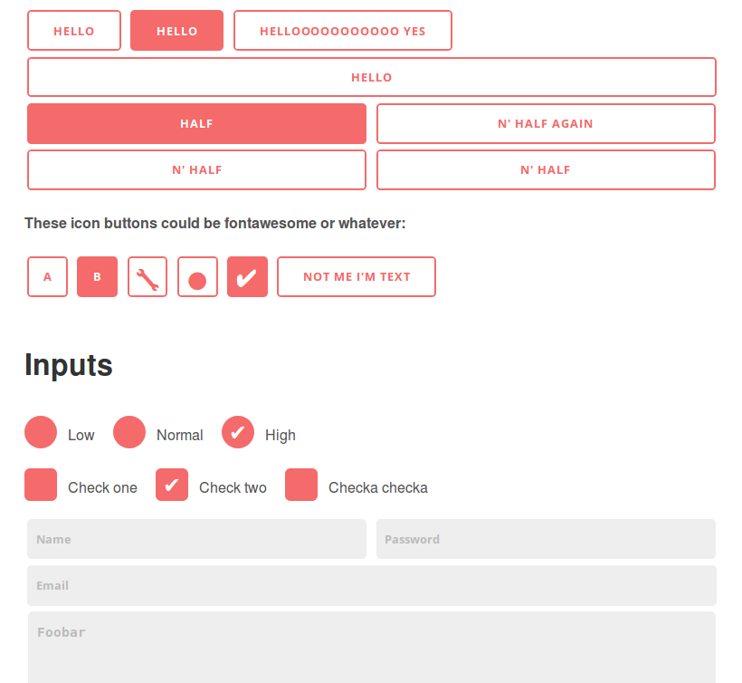

As a developer I often need to throw together a basic HTML + JS + CSS page to test or prototype some idea.

These minimal stylesheets get us one step beyond `Times New Roman` to make such a basic page or web app look non-terrible: [demo page](https://chr15m.github.io/minimal-stylesheet).



There's a `< 1k` stylesheet for basic HTML styles and a separate `3.2k` one for buttons, forms etc. and they are designed so that the result looks basically the same across different devices.

```html
<link rel="stylesheet" type="text/css" href="//chr15m.github.io/minimal-stylesheet/minimal.css"/>

<link rel="stylesheet" type="text/css" href="//chr15m.github.io/minimal-stylesheet/minimal-inputs.css"/>
```

### Tips

 * Set the `font-size` on `body` to scale up or down the whole interface.
 * Do a search and replace of `#f56a6a` to theme it with your own color.

